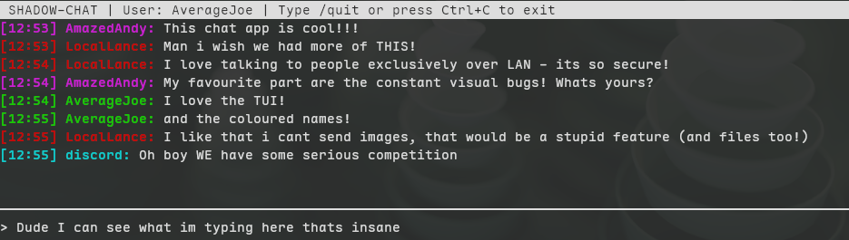

# SHADOW CHAT

A peer2peer LAN chatroom client, written in Python for your Terminal.

## 'What + Why'

In an age of the internet where simplicity is scarse, shadowchat does eactly what it says, and nothing else.

**Features**

- P2P chat, no need for a central server

- TUI interface made with curses

- Active maintenance

- Window and linux support

- Zero levels of encyption

---

### Demo



---

### Instructions

Download the executable from the latest release and run:

**macOS/Linux**

```bash
./shadow_chat
```

**Windows**

Just run the .exe

### Testing locally

1. Install [just](https://just.systems/)
2. Install requirements from `requirements.txt` with `pip install -r requirements.txt`
2. Run `just test`
